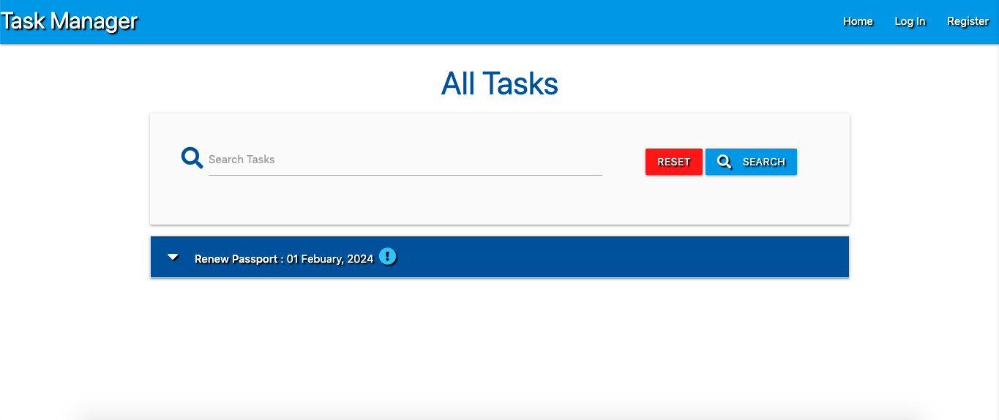

# Task Manager App

- This project was to create a task managment application using flask. 
- This project was a walkthrough from the Code Institute Full-Stack development course. 
- The purpose of this project was to learn the basics of Flask, Mongodb and Materialize.
- Mongodb was used as the database.
- Materialize was used for styling.

## Live project

- [View the live project here.](https://brians-task-app.herokuapp.com/)

## Screenshots

  - 

### Languages and Technologies Used.

- [HTML5](https://en.wikipedia.org/wiki/HTML5)

  - HTML5 was used to create the content and base of each page.

- [CSS3](https://en.wikipedia.org/wiki/CSS)

  - CSS3 was used to then style the page and make it responsive through media queries, and interactive through using CSS transitions.

- [Bootstrap 4](https://getbootstrap.com/)

  - I used bootstrap throughout the site to make it responsive. I also used bootstrap to create the booking forms, and the modals pop up when the forms have been submitted.